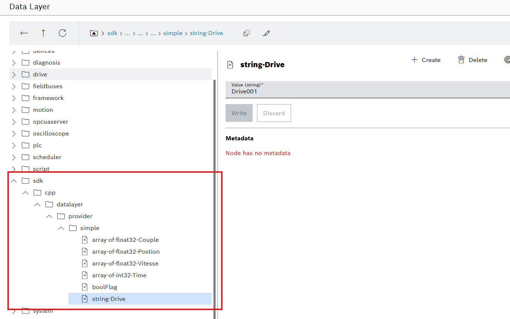
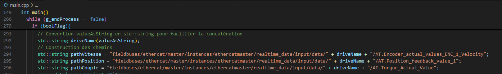

# Sampler smart check sizing app
## Entrevue


## Objectifs

plop
Cette application, crée des noeuds sur la datalayer. Ces noeuf servent à stocker sous forme d'array l'aquisition des données remontées en ethercat.

Cette app est la fusion de deux exemples fournis par le sdk en cpp : Datalayer.client et datalayer.provider.

l'app fonctionne en paire avec l'application [Smart Check Sizing](https://github.com/Felix-73/CTRLX-SDK-APP-Sampler-Smart-check-sizing) 

Pour changer le chemin où sont remontées les données 



Le flag qui lance l'acquisition des données est boolFlag. Ce booléen doit être attaqué depuis le plc ou l'app qui gère la partie motion.

## Build l'app
-  git clone
- ```sudo ./build-snap-amd64.sh``` ou ```sudo ./build-snap-arm64.sh```

## Comment Debug 
[How To](https://community.boschrexroth.com/ctrlx-automation-how-tos-qmglrz33/post/debug-c-apps-with-sdk-for-ctrlx-automation-yRRkCN1eGXGPoLl)

## Liens utiles
[open classroom cpp](https://openclassrooms.com/fr/courses/1894236-apprenez-a-programmer-en-c)

[open classroom cpp POO](https://openclassrooms.com/fr/courses/7137751-programmez-en-oriente-objet-avec-c)

[Prendre une pause](https://pointerpointer.com/)